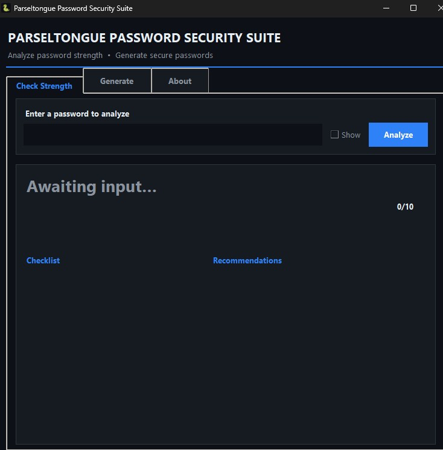
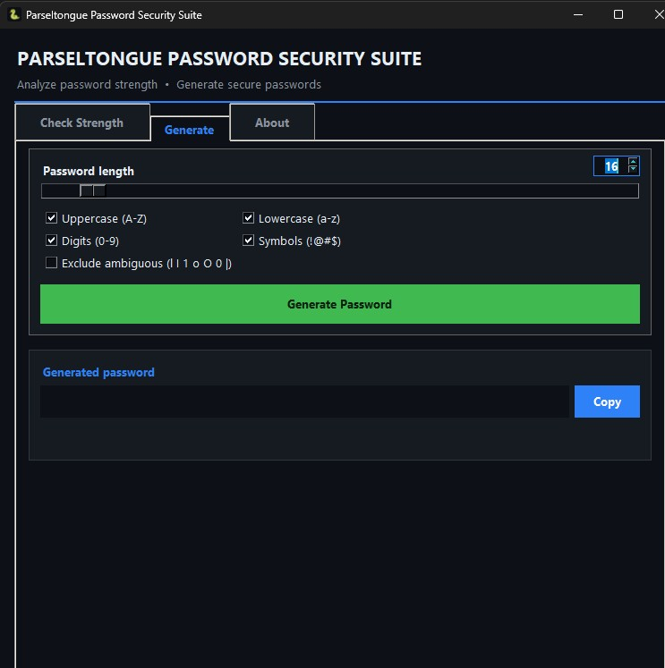
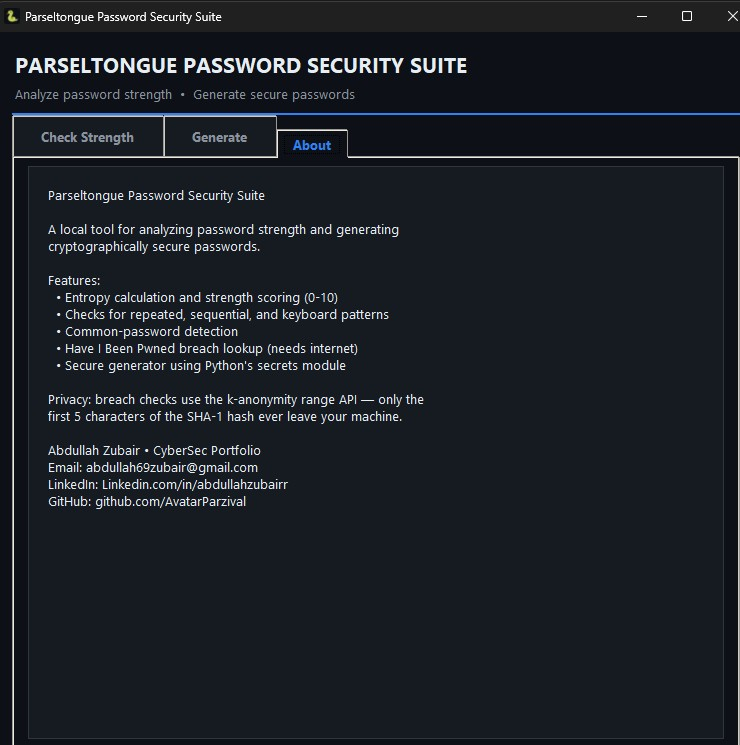

# 🐍 Parseltongue Password Security Suite

> A sleek, dark-themed desktop app for analyzing password strength and generating cryptographically secure passwords — built in pure Python with Tkinter.

<p align="left">
  
  
  
  
</p>

---

## 📑 Table of Contents

- [✨ Features](#-features)
- [🖼️ Interface](#-interface)
- [📸 Screenshots](#-Screenshots)
- [🚀 Getting Started](#-getting-started)
- [🧮 How Scoring Works](#-how-scoring-works)
- [🔐 Privacy](#-privacy)
- [📁 Project Structure](#-project-structure)
- [🛠️ Requirements](#-requirements)
- [📄 License](#-license)

---

## ✨ Features

- **🔍 Strength analyzer** — scores any password from 0–10 with a live strength bar, color-coded rating, and detailed checklist.
- **📊 Entropy calculation** — estimates bits of entropy based on character pool and length.
- **🕵️ Breach detection** — checks passwords against the [Have I Been Pwned](https://haveibeenpwned.com/) database using the privacy-preserving *k-anonymity* range API (only the first 5 characters of the SHA-1 hash ever leave your machine).
- **🧠 Pattern detection** — flags repeated characters, sequential strings (`abcd`, `1234`), and keyboard walks (`qwerty`, `asdf`).
- **⚙️ Secure generator** — creates passwords using Python's `secrets` module, with an editable length (8–128), character-set toggles, and an option to exclude ambiguous characters.
- **🎨 Modern dark UI** — tabbed layout, black title bar, and a custom snake icon.
- **📋 One-click copy** — copy generated passwords straight to the clipboard.

---

## 🖼️ Interface

The app is organized into three tabs:

| Tab | Purpose |
| --- | --- |
| **Check Strength** | Analyze a password: rating, score, entropy, breach status, checklist, and recommendations. |
| **Generate** | Build a secure password with a length slider/number box and character-type options. |
| **About** | Project info and privacy notes. |

---

## 📸 Screenshots

| Check Strength | Password Generator |
|--------------|----------------------|
|  |  |

| About |
|---------------|
|  |

---

## 🚀 Getting Started

### Run from source

```bash
python Parseltongue.py
```

> Tkinter ships with the standard Python installer, so no extra dependencies are required to run the app.

### Build a standalone `.exe` (Windows)

The easiest way is to double-click **`build_exe.bat`**, or run:

```bash
pip install pyinstaller
python -m PyInstaller --onefile --windowed --name Parseltongue ^
    --icon snake.ico --add-data "snake.ico;." --add-data "snake.png;." ^
    Parseltongue.py
```

The finished app appears at `dist\Parseltongue.exe`.

| Flag | Why |
| --- | --- |
| `--onefile` | Bundle everything into a single `.exe`. |
| `--windowed` | No console window (this is a GUI app). |
| `--icon snake.ico` | Snake icon on the executable. |
| `--add-data` | Bundle the icon files so the window/taskbar show the snake. |

> 💡 **Tip:** use `python -m PyInstaller ...` if the bare `pyinstaller` command gives a *“not recognized”* error — that's a PATH issue this avoids.

---

## 🧮 How scoring works

The overall score (capped 0–10) rewards:

- **Length** — up to +3 (12+ and 16+ characters).
- **Character variety** — +1 each for lowercase, uppercase, digits, and symbols.
- **Entropy** — up to +3 (≥40, ≥60, ≥80 bits).

and penalizes:

- Repeated characters, sequential strings, and keyboard patterns (−1 each).
- Common passwords and known breaches force the score to the floor.

| Score | Rating |
| --- | --- |
| 0–2 | Very Weak |
| 3–4 | Weak |
| 5–6 | Medium |
| 7–8 | Strong |
| 9–10 | Very Strong |

---

## 🔐 Privacy

Breach checks use the **HIBP range API**: the password is SHA-1 hashed locally, and only the **first 5 hex characters** of that hash are sent. The full password — and even its complete hash — never leave your computer. The breach check needs internet; every other feature works fully offline.

---

## 📁 Project structure

```
.
├── Parseltongue.py   # the application
├── snake.ico              # window / executable icon
├── snake.png              # icon (PNG fallback)
├── build_exe.bat          # one-click Windows build script
└── README.md              # this file
```

---

## 🛠️ Requirements

- Python 3.8+ (3.12+ recommended)
- Tkinter (included with standard Python)
- PyInstaller — only needed to build the `.exe`

---

## 🧑‍💻 Author

**Parseltongue Password Security Suite** was created and maintained by **Abdullah Zubair**  
- GitHub: [@AvatarParzival](https://github.com/AvatarParzival)
- LinkedIn: [Abdullah Zubair](https://www.linkedin.com/in/abdullahzubairr)
- Email: [abdullah69zubair@gmail.com](abdullah69zubair@gmail.com)

## 📄 License

Released under the MIT License — free to use, modify, and distribute.

---

<sub>Built by <b>VortexTech</b> · CyberSec Portfolio</sub>
